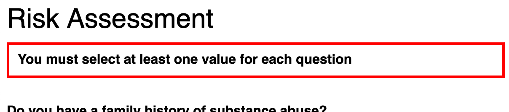
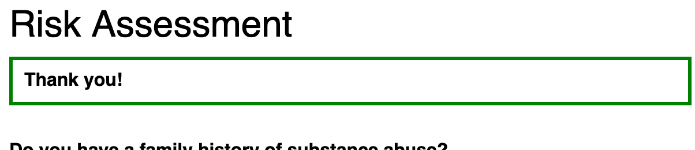
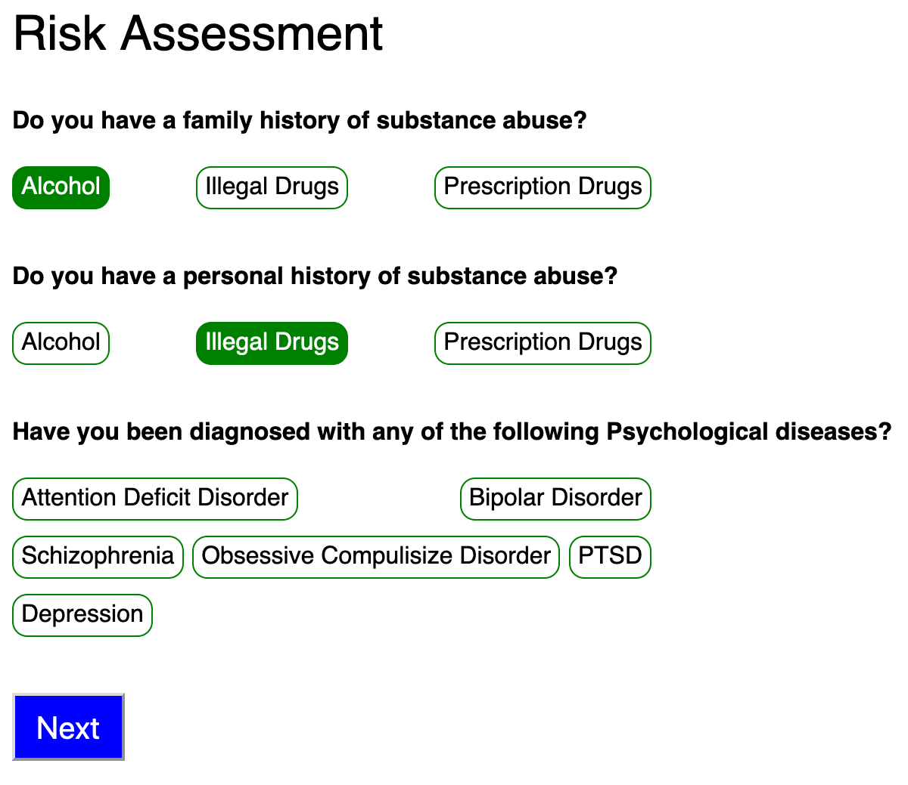

# Epion Front End Interview Project

_Epion devs: please see [README-epion.md](README-epion.md)_

Thanks for being interested in coming to work here at Epion Health. Our team values building, reviewing, and pairing on well-crafted applications.  This repo was built to test how you build applications and how you would fit in working with the team at Epion.  It's a simplified version of an assessment form in our Check-in application, and will give you some insight into our product development process.  If you'd like to learn more about our Check-in product please visit our [website](https://epionhealth.com/patient-engagement-software/patient-check-in-software/)

We will use Slack to share your screen unless that wouldn't work for you. Please make sure you have the desktop app installed beforehand.

## Let's get started (Take home section)

### Setup

Please go ahead and clone this repo. Before you start, you should have:

* Node 12+
* Yarn 1.22.x

## Installing dependencies

In the project directory, run:

### `yarn`

## Running the project

In the project directory, run:

### `yarn start`

Runs the app in the development mode. 
Open [http://localhost:3000](http://localhost:3000) to view it in the browser.

The page will reload if you make edits. 
You will also see any lint errors in the console.

## Running the tests

Now you can run the tests and watch them fail!

### `yarn test`

Now to complete the pre-interview part tasks:

- [ ] add enough code to make the test pass
- [ ] Email your interviewer with [patch file(s)](https://thoughtbot.com/blog/send-a-patch-to-someone-using-git-format-patch) containing your changes.

We will review your code as a team, and reach back out to you to set up a pairing session

## Pairing Session

We will have a pairing session where you will share you screen with a couple of Epion developers and add some features to the form.

- [ ] Keep track of the state of the form
- [ ] Validate the form when the user submits
- [ ] Change the checkboxes to appear as "tags"

When you have implemented the validation, the form should have a message at the top. If there are any questions for which you have not provided answers, you should see this:

> 

If you check off at least one option for each question, you should see this:

> 

When you have converted the checkboxes to tags, they should look like this:

> 

This project was bootstrapped with [Create React App](https://github.com/facebook/create-react-app).
